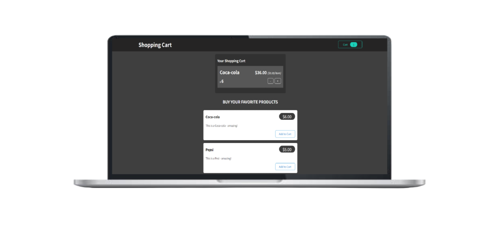

<h1 align="center">
  Shopping Cart
</h1>

  

## ✨ Tecnologias

Esse projeto foi desenvolvido com as seguintes tecnologias:

- [React](https://react.dev)
- [Redux](https://react-redux.js.org)
- [CSS](https://www.w3schools.com/css/)
- [JavaScript](https://developer.mozilla.org/pt-BR/docs/Web/JavaScript)

## 💻 Projeto

O Shopping Cart de compra de um carrinho de supermercado que utiliza Redux para lidar com os dados.

## 🔖 Acesso

[Shopping Cart](https://shopping-cart-0a.netlify.app)

## 🚀 Como executar

- Clone o repositório
- Instale as dependências com `npm install`
- Inicie o servidor com `npm run start`

Agora você pode acessar [`localhost:3000`](http://localhost:3000) do seu navegador.

---
